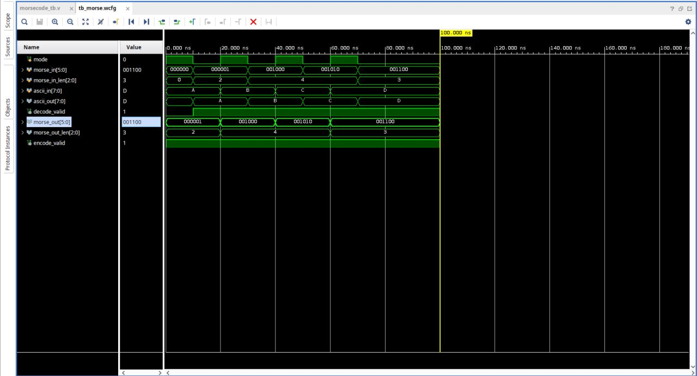

# Morse Code Encoder & Decoder using Verilog

This Verilog HDL-based project implements a **Morse Code Encoder and Decoder** for converting between ASCII characters and their corresponding Morse code representations. The design uses **LUT/ROM-based mapping** for Morse code translation and is verified through **simulation, RTL schematic analysis, synthesis, and power analysis** using Xilinx Vivado.

---

## Project Demo / Simulation



---

## Features

- ASCII character to Morse code encoding
- Morse code to ASCII character decoding
- LUT/ROM-based Morse code mapping
- Separate encoder and decoder functionality
- Verilog HDL-based RTL design
- Functional verification using Vivado simulation
- Simulation waveform analysis
- RTL schematic generation
- Logic synthesis using Xilinx Vivado
- Hardware resource utilization analysis
- Power estimation using Vivado

---

## Design Architecture

The project consists of two main functional blocks:

```text
              ┌─────────────────────┐
              │    ASCII INPUT      │
              │     Character       │
              └──────────┬──────────┘
                         │
                         ▼
              ┌─────────────────────┐
              │   MORSE ENCODER     │
              │     LUT / ROM       │
              └──────────┬──────────┘
                         │
                         ▼
              ┌─────────────────────┐
              │   MORSE CODE OUT    │
              │  Pattern + Length   │
              └─────────────────────┘


              ┌─────────────────────┐
              │   MORSE CODE IN     │
              │  Pattern + Length   │
              └──────────┬──────────┘
                         │
                         ▼
              ┌─────────────────────┐
              │   MORSE DECODER     │
              │     LUT / ROM       │
              └──────────┬──────────┘
                         │
                         ▼
              ┌─────────────────────┐
              │    ASCII OUTPUT     │
              │      Character      │
              └─────────────────────┘
